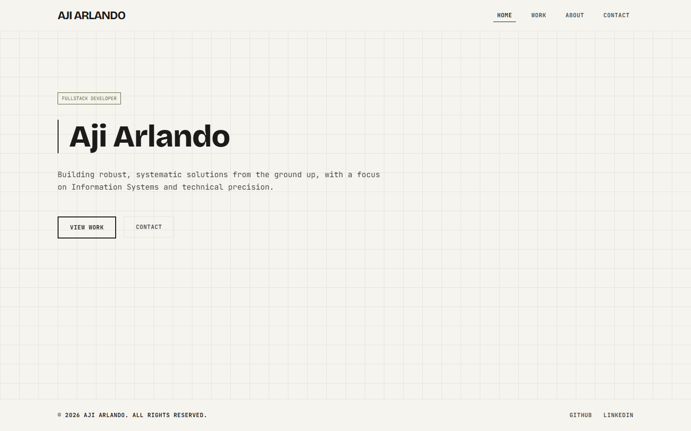

# Aji Arlando - Fullstack Developer Portfolio 🚀

A modern, systematic web portfolio built from the ground up, highlighting technical precision, robust architecture, and high performance.

🔗 **Live Demo:** [ajiarlando.my.id](https://ajiarlando.my.id)



## 📖 About the Project

This repository contains the source code for my personal portfolio. It is a complete architectural rebuild designed to reflect my approach to software engineering. The UI follows a strict **"Structural Honesty"** design philosophy:
- **Sharp Edges:** `0px` border-radius across all components.
- **Exposed Grid:** Backgrounds mimicking architectural blueprint grid lines.
- **No Artificial Depth:** Stripped away drop shadows in favor of flat, high-contrast, hairline borders.
- **Visual Transparency:** Emphasizing raw structure over ornamental flair.

## 🛠️ Tech Stack

- **Framework:** Next.js 16.3.1 (App Router)
- **Language:** TypeScript
- **Styling:** Tailwind CSS v4 (via `@tailwindcss/postcss`)
- **Backend & Auth:** Supabase (PostgreSQL + Authentication + Storage)
- **Image Optimization:** Next.js Image Optimization integrated with Supabase Storage remote patterns
- **Testing:** Vitest (Unit) & Playwright (E2E)
- **Deployment:** Vercel (with Analytics & Speed Insights)

## ✨ Features & Architecture

- **Public Facing Pages:** 
  - `/` (Home)
  - `/work` (Selected Work Grid)
  - `/work/[slug]` (Dynamic Project Detail Page, gracefully migrated from legacy `/project/:slug`)
  - `/about` (Profile & Tech Stack)
  - `/contact` (Contact Information)
- **Admin Dashboard:** A fully protected internal CMS (`/dashboard`) for executing CRUD operations on portfolio projects, including automated image WebP compression on upload.
- **Auth Guard:** Supabase Authentication securing all `/dashboard` and `/login` routes.
- **SEO & Performance:** 
  - Dynamic metadata injection (perfect 100 SEO scores)
  - Next.js Image Optimization for LCP and responsive `sizes` delivery
  - Auto-generated `sitemap.xml` & `robots.ts`
- **Testing Coverage:** End-to-End flows tested via Playwright and unit-level coverage via Vitest.

## 📂 Project Structure

```text
src/
├── app/                  # Next.js App Router (Public routes & protected /dashboard)
├── components/           
│   ├── dashboard/        # CMS and Admin components (e.g. ProjectFormModal)
│   ├── layout/           # Shared page wrappers (Navbar, Footer, Grid Background)
│   └── ui/               # Reusable primitive components (ProjectCard, TechTag)
├── lib/                  # Supabase SSR clients, constants, utilities, types
tests/
└── e2e/                  # Playwright E2E test suites (e.g. public.spec.ts)
```

## 🚀 Running Locally

To run this project on your local machine:

1. **Clone the repository:**
   ```bash
   git clone https://github.com/ajiarl/portofolio-v2.git
   cd portofolio-v2
   ```

2. **Install dependencies:**
   ```bash
   npm install
   ```

3. **Set up Environment Variables:**
   Create a `.env.local` file in the root directory and define the following variables:
   ```env
   NEXT_PUBLIC_SUPABASE_URL=
   NEXT_PUBLIC_SUPABASE_ANON_KEY=
   NEXT_PUBLIC_SITE_URL=
   ```

4. **Available Scripts:**
   - `npm run dev`: Start the development server
   - `npm run build`: Build for production
   - `npm run start`: Start the production server
   - `npm run lint`: Run ESLint checks
   - `npm run test`: Run unit tests with Vitest
   - `npm run test:watch`: Run unit tests in watch mode
   - `npx playwright test`: Run End-to-End tests

5. **Run the development server:**
   ```bash
   npm run dev
   ```
   Open [http://localhost:3000](http://localhost:3000) in your browser.

## 📫 Contact

Want to collaborate, discuss technical implementations, or just say hi? 
- Reach out via the [Contact Page](https://ajiarlando.my.id/contact)
- Email: [ajiarlando127@gmail.com](mailto:ajiarlando127@gmail.com)
